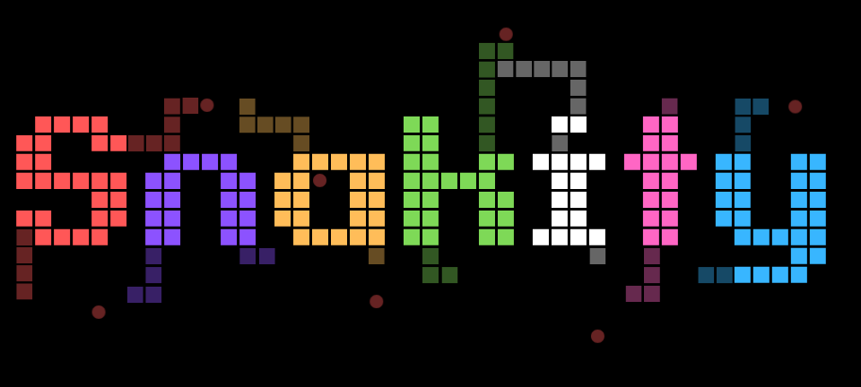

# Battlesnake Blackout Snake Bot (2nd place)

This was built for the IEEE CoG 2026 Battlesnake Blackout competition and placed second.

This repo contains everything required to train a battlesnake blackout PPO model from scratch using cirriculm learning, pooled self play, and experiement with a few different techniques including ExIT (https://arxiv.org/abs/1705.08439), PFSP (https://www.nature.com/articles/s41586-019-1724-z), potential based reward shaping (https://arxiv.org/abs/2402.07411) as well as applying the shapeshifter battlesnake engine (https://github.com/JonathanArns/shapeshifter) as a ground truth for the best move. 

The final version of Snakity was a 1.26 million parameter actor-critic LSTM RL model trained via pooled self-play on ~3B game ticks obtaining 2nd place.

### The files

These are the main files you will probably find useful:

|File name| |
|--|--|
|basic_rl.py|Main training loop logic, you can also ctrl + c, change some training parameters and resume easily, automatic checkpoint resumption is underrated. (Also the file was basic when I created it)|
|battlesnakes_server.py|Hosts the battlesnake server.|
|battle_snakity_webserver.py|Hosts a web server where you can verse snakity yourself with or without the fog of war.|
|game.py|This is the fast RL environment (using up ~1.2% wall clock time in my training runs on a GPU) which I hope has a somewhat intuative API if your planning on using it. The only difference between the game and the env is that apples can spawn diagonally adjucent to snake heads which they dont in battlesnakes but that shouldn't matter.|

|File name| |
|--|--|
|benchmark.py|Helps you find the optimal batch size|
|bench_game.py|General benchmark|
|create_pool.py|Creates a new pool.pt file based on a checkpoint folder in case the current one gets corrupted/broken|
|add_to_pool.py|Allows for manually adding checkpoints to the pool|
|winrate_matrix.py|Runs pair wise evaluations over all the checkpoints recording win rate|
|tourn_matrix.py|Runs pair wise evaluations over all the checkpoints recording in the competitions 2/1/0/0 point scoring rule|
|eval.py|Like above 2 but does a bunch of games with only 4 checkpoints.|
|obsmem.py|Mostly feature engineering|
|snakenet.py|Pytorch model for snakity|

Note that due to the model weights in the repo it might be a bit slow to download.

Below I included the writeup which is on kaggle (https://www.kaggle.com/writeups/dan13iel/snakity-battlesnake-blackout-2026)

# What is Battlesnake Blackout

Battlesnake Blackout is a IEEE CoG 2026 coding competition where the goal is to develop the best snake bot. Unlike standard battlesnakes, the blackout variant uses a 15x15 grid (larger than the typical 11x11) and a 5 manhattan distance max view radius (bots can however see the spawn location of the apple that spawned on a given tick regardless of apple location). In head to head collisions of snakes the longer one wins (equal length results in both snakes dying) and the scoring is 2/1/0/0 per game.

### Quick Definitions (so that we are on the same page)
- Episode: A batch of games run concurrently used in the same back propagation cycle.
- Game tick: A step of a single battlesnake board.
- Battlesnakes/Battle snakes: Most of the time I am referring to Battlesnake Blackout

# The features
Channels 1-9 (see model architecture):

### Binary channels:
- Unknown (Cell has never been seen before, or the memory of the cell decayed)
- Empty (Cell last seen as unoccupied)
- Own body
- Off Board
- Opponent Body (But it only stays opponent body for 3 ticks without observation before becoming unknown. I didn't explore fine tuning how long the opponent body stays in memory)
- Food (Appears when an apple spawns, doesn't update/despawn unless the snake can see the cell)

### Scalar channels:
- Memory age (How many ticks since the snake last saw a given cell, ranges 0-32 ticks and normalised to [0,1])
- Head Advantage (A contest outcome estimate of which snake would win head to head written onto the 4 directly adjacent cells to an opponents head. The opponents length is estimated as the most seen segments at any one time. The fog of war rule forces this to be underestimated consistently so I skewed the thresholds to be pessimistic, +1.0 when Snakity is at least 2 longer than the estimate, -0.5 at a margin of +1 and -1 when the opponents estimate matches or exceeds Snakitys length)
- Ticks until cell cleared (1 at the tail, snake length near the head, tells the model where it is and how long until a cell is cleared for example when its tail following in a circle)

### Scalar Features:
Normalisation is in brackets
- Length (/40)
- Timestep (/255) (clamped to 255 so the model cant really tell apart late game stages from timestep alone however looking at the board or LSTM data would have provided far better information then a timestep) 
- Head X (/14)
- Head Y (/14)

- Health (constant 100 since I was too lazy to deal with it, technically should be in the model architecture diagram but isn't)

I initially had health but didnt want to deal with that server/serving side (which was painful enough) so I just hard coded it to be 100 in training and inference. Now the model does *sometimes* die to starvation (in self play) but oh well. 

##### Here is how the spatial channels would look in practise during a game:

When doing some prototyping on a smaller model I found that adding normalisation to my features improved training performance by a ridiculous amount (previously I converged at 30% win rate versing safe random, after adding normalisation I managed to get ~80% the next training run).

To improve the training speed of the model I rotated the models frame of reference such that the model was always looking in the same forward direction. The actor only predicts between forward, left and right relative to current heading (which improved training performance significantly as the model didn't need to learn all 4 possible rotations). This was used for both the actor and critic. 

# The Model Architecture
Snakity takes as input a 9 channel 13x13 head centered square crop of the board as input, the 4 scaler features and 128D LSTM vector. I used an actor-critic setup to accelerate the training process significantly. The 7 channels for the **critic** were the snake segments for each snake (4), a channel showing where each head was (1), a channel for all the food (1) and a channel to mark out of bounds cells (1). The privileged critic can see the entire board and the absolute snake ids (unlike the policy model which sees itself as snake 0, an optimisation to reduce the amount of noise) but is still canonicalised to the snake bot's rotation. Note that all the convolutions have pad=1 (except for the squeeze) and the critic model is only used during training. I did not test to see if canonicalisation or if a critic helped the model learn faster, rather I assumed they did since they provided the model with a stronger signal and removed the need to spend parameters on learning rotation independence. Additionally a lot of other self play setups used a critic model and canonicalisation seemed like a reasonable optimisation.
.png?generation=1788403617851543&alt=media)
Note: In terms of parameter counts the actor has 1.26M parameters and the critic has 746k.

A 13x13 head centered crop provided significantly more view then 5 manhatten distance (on a board showing last seen, not current), but increasing it required more parameters and hence had slower training. I didn't do any parameter sweeps to determine if 13x13 is optimal.

# Training Snakity
### The RL Environment
My strategy for RL environments is simple, make the environment as fast as possible so that I never need to worry about a lack of data, CPU compute or the RL environment again. I benchmarked the provided hisss battlesnakes game engine and it yielded poor results, ~1.2-0.8ms/game tick/core. The most likely cause is that its single threaded and whilst a single game tick is fast, the overhead of sequentially calling game ticks caused performance issues. I rewrote the hisss battlesnakes engine (a minimal standard subset, the blackout logic was added on top in feature generation) in python with numba nopython=True on every function and used numpy heavily to vectorise the code. After some fine tuning of the batch size so that the game data would fit into L3 cache I managed to get ~70ns/game tick (in batchs of 850, which each took ~0.059ms). Any batchs larger then that would sharply slow degrade in performance down to ~220ns/game tick most likely due to the game data needing to be shuffled around in RAM rather than L3 cache. 70ns per game tick (amortised over a batch size of 850) translates to roughly 14.3 million game ticks per second per core which realistically I would never train at. The RL engines speed allowed me to focus only on improving the model and its speed rather than trading CPU for more GPU compute (e.g increasing PPO steps/repeats from 2 to 4 or 5 would make better use of less data from RL but for a much higher GPU cost). The performance was achieved by storing everything in batches in arrays in efficient formats and relaying heavily on bit wise operations. The main data was packed into a ring buffer of shape (batch size, 4, 225) of uint32. 

The ring buffer stores snake segments rather than a grid with snake segments on it, so to perform one movement timestep the only operations needed are:
1. Decrement ticks until cleared for all of the snake segments
2. Remove all snake segments with age > length
3. Grab the next entry in the ring buffer (which conveniently is timestep % 225, although game tick % 225 also works), check if the snake is going to die, then move the snake head.
4. Handle edge cases for moving snake head into the tail location of a snake which hasn't been updated.
  
Note: One character is one bit and a sentinel value of 0xF was used to indicate an empty cell. You can see that the RL environment made up for ~1.2% of wall clock time (see compute section) which let me spend my effort on optimising the GPU once I finished developing it. One minor discrepancy between the RL environment and HISSS that I forgot to add was the apples dont spawn next to (not including diagonal) snake heads.

### Initalisation & Hyperparmeters
The convolution and linear layers were all initialised to be orthogonal with various amounts of gain (all set to `nn.init.calculate_gain('relu')` in pytorch except for the policy head with gain=0.01 and the value head with gain=1.0) and the biases were all initialised with zeros. During self play I set the learning rate to a very low value for PPO, 2e-5, in order to make the very small opponent sampling (near the end of the training run it was 5, so for 70 concurrent games there would be 3 different model sampled from a pool of 5 unique models that were selected for a given episode, the 5 models were sampled from the main model pool with all the checkpoints) work. If I set a high learning rate and opponent pool then the model would have good gradients but would be slow to converge. 

| Hyperparameter | Value |
| --- | --- |
| gamma | 0.995 |
| GAE lambda | 0.97 |
| value coefficient | 0.5 (loss = policy loss + 0.5 * value loss) |
| PPO epochs | 2 |
| PPO epsilon | 0.2 |
| Gradient clip | Clipped to 0.5 |

I found that improving the hyperparameters past a reasonable default wasn't needed especially in the first 5k episodes where the model was playing safe random. To prevent anything resembling rock paper scissors in terms of Battlesnake strategies I kept on increasing the max opponent pool size such that no model ever got removed from it during self play. 

### Dealing with the LSTM
Since I had limited VRAM and methods like BPTT/TBPTT didnt work (after a few dozen thousand episodes), I accumulated the LSTM state during rollout with a detached hidden state. Consequently, each training step only back propagated one tick and it most likely worked due to the information provided by the features/feature engineering. Since the gradients didn't back propagate past one tick I was curious as to how useful the LSTM is so I ran an 5k game ablation on the best checkpoint (ep88599). 

In terms of win rate:
| Opponent | Normal LSTM | Zeroed LSTM |
| --- | --- | --- |
| 3x Normal Snakity | 0.246 +/- 0.011 (0.25 expected) | 0.155 +/- 0.010 (0.25 expected) |
| 3x Safe Random | 0.9968 +/- 0.0016 | 0.9928 +/- 0.0023 |

In games with competent opponents the LSTM seems to contain useful information whilst with trivial opponents the model doesn't appear to use the LSTM nearly as much and zeroing the LSTM kills the model in ~0.4% of trivial games.

### The Training Run
The general specs:
- PPO (grad clipping at 0.5, PPO epochs set to 2)
- ~20-30k game ticks/second when learning on safe random, ~9k game ticks/s during self play
- Model promotes to pool typically every 400 episodes early in (around 30k episodes in) and every 600-800 episodes near 60k+ episodes of training. 
- Ran for around 1-2 weeks.
- 3 billion game ticks (estimated, the final checkpoint was 88599 episodes, I looked through my git history and got an estimated ~90 average batch size and ~380 game duration. `88599 * 380 * 90 = ~3B`)

I only had a single large training run due to the nature of RL training and a deadline but I did make adjustments to the training loop and parameters over the course of the run.  I employed curriculum learning and started training Snakity by first doing 5k episodes (at a batch size of ~400 or so) versing safe random, i.e choose a random move that won't instantly kill the snake. After 5k episodes the model was able to beat safe random ~97% of the time. Note that the max game duration was capped at 300 ticks and was rarely ever hit. 

Afterwards I switched to pooled self play without a max opponent count (to prevent rock-paper-scissors dynamics when learning), reduced the batch size ~75 (balancing memory, speed and gradient quality) and set the promotion to pool threshold to 55% win rate.

### A rough timeline of training:
**Start to 5k episodes**: Safe random opponents, debugging literally everything including things I thought couldnt possibly have invisible bugs. I learnt the hard way that you should do torch.save to a temp file BEFORE renaming it to the checkpoint filename. (If a checkpoint write fails, due to a very hypothetical lack of memory then hypothetically you could corrupt your checkpoint and if you hypothetically resumed from that corrupt checkpoint and thought the optimiser just restarted since you hypothetically didn't save the optimiser state then you would in this very hypothetical case be very confused and waste a day or so of compute trying to get the model to actually learn).

**5k to about 21K**: Self play is introduced. The main idea was to make it get the most reward signals/h and to generally make sure that the setup was capable (and wouldn't for example have some other stupid mistake like not normalising inputs/features). The biggest optimisations were using bf16 autocasting, compiling all (except for the LSTM cell) with reduce overhead mode like `torch.compile(mode="reduce-overhead")` and using Adam with fused = True improved performance. I raised the max game duration to 500.

**21K-80K**: Made sure that the pool was never going to fill up to its max, generalisation was really important as training an overfit model, or a model in general to beat rock paper scissors for 80K episodes would be a massive set back. Experimented with longer max game durations, settled on 400. 

At around **80K episodes** I saw that Snakity wasn't good enough and I didn't have a lot of time left, like 3 or 4 days before the tournament eval. My first idea was that the pool just simply wasn't hard enough. Long story short the privileged MCTS Battlesnakes (I sniped it from the battlesnakes discord server: [github.com/JonathanArns/shapeshifter](https://github.com/JonathanArns/shapeshifter)) bot at depth **2** absolutely destroyed Snakity, both in terms of game play and weights (I also had to lower it to depth <4 otherwise training took 20x longer O.O). I did some fine tuning of the training parameters and config to try to prevent this (15% chance shapeshift appeared in a game with Snakity) but that led to still a massive gradient norm increase, from 0.05 before to a consistent 0.4-0.5 after. The model had converged but the shapeshifter gradients were large enough to revert this causing bad weight degradation. Consequently it created a more defensive model that had developed a unique suboptimal play style (That being more random movements that made the model jagged and oblivious to potential threats, you can play the PTSD Snakity on the url at the bottom). I raised the max game duration to 800 for a few thousand episodes then lowered it down to 600.
Additionally on the side I trained an exploiter model, i.e a model that focused purely on winning against a single checkpoint to find a specific flaw in its strategy but it didnt yield anything significant, I chucked it into the model opponent pool anyways).

I added a few checkpoints from the more promising experiment to the pool (which I had overridden so I needed to regenerate it from my checkpoints.... checkpoints are super useful) and instantly the model just started to learn like 3x quicker or something. 

Before: Model passes the 55% win rate threshold by a few percent (think e.g 57%) every 600-800 episodes (Eval was every 200)
After: The model passes the 55% win rate threshold by 5-10% (so like 62-68%) every 400 episodes. The per checkpoint gains were probably the highest since the model started its training very early on.

So, pool diversity is important and adding diverse opponents turns out to be REALLY useful for the model, good for training. By that point there were only 2 days remaining, so I kept on training with the better pool. I managed to get to 90k episodes (ep89999) before time was up however it was not the optimal checkpoint in terms of average points per game.

#### Selecting the right checkpoint
A few hours before the final evaluation began I got the last 15 or so checkpoints, ran 300 games per pair (roughly 68k games) and chose the highest point scoring checkpoint (which turned out to not be the latest, it was behind about 1400 episodes).

### Compute
I maybe have gone slightly over budget and in total spent ~120$ USD on GPUs O.O
It was all worth it for the learning experience, however. I started out of a 5070Ti which worked for initially prototyping the GPU code since it was cheap and decently spec'ed but later on around 35k episodes in I switched to a modded 4090 with 48GB of VRAM and it worked great. The training wall clock time was around 1-2 weeks, but again changes and improvements were made along the way to the training code. A good chunk of the time was spent testing and idle on the 5070 Ti rather than on the final training run.

In terms of how that compute was used here is a profiler result from a 3h training segment:

The dequantise that appears in the profiler is the binary features being converted into tensors for the model. The largest chunk of compute was spent on stepping opponents which is why I chose to sample few opponents, the slightly better gradient was not worth the additional kernel launch latency for each game tick for 50 or 100 separate snakes. 
Note that this profile was taken with `torch.compile` used and on an RTX 4090 GPU.

### Serving Snakity
I used railway for the web host and due to the small size of the actor, 1.26M parameters, the median latency was ~12ms (p99 was 25ms). The only pain point was building the entire hosting thing to support concurrent games, LSTM statefulness, translating between a batched vectorised engine format and objects, etc. It was quite a painful experience. I ended up needing to run Snaktiy twice due to how alive/dead snake flags were packed since I was not bothered to remake my data to Snakity converter from the RL environment. 

### Reward Function

I had 3 main iterations of the reward function:
1. Binary win/lose (so +1/-1). This was noisy, ineffective and expensive to say the least.
2. Binary win/lose but with potential based shaping, which gave me far better quality data. The potentials were quite generic, just get up to 40 segments long, eating apples helps and other snakes dying also helps.
3. I just copied the tournament reward 2/1/0/0, made it zero sum normalised it (r = (points − 0.75) / 1.25) and kept the same potential based reward shaping. Whilst that was it for the reward function I used truncation bootstrapping, i.e setting the reward to the value function at the last game tick instead of 0 for games that will run over the max game tick count, this improved Snakitys performance on longer games significantly.

# What I tried and failed :(
This is a long list... Unfortunately.
- BPTT/TBPTT (Truncated Back Propagation Through Time): TBPTT providing an ok (~1.2x faster) speed up but lobotomised the training process. Whilst the game outcome reward signal did back propagate backwards the value function didn't.
- Sampling a lot of opponents: Whilst this did improve performance the ticks/s when training dropped too quickly for my liking. I did reduce it to about 10 or so by 25k episodes. (FYI: Opponents sampled is opponents sampled from the pool to then be sampled into B concurrent games, where B is batch size and fewer opponents means better batching and less GPU kernel launch overhead).   
- Increasing PPO epochs past 2 (aka PPO steps): The fast RL environment let me get as much data as needed and it turns out PPO epochs=2 is the sweet spot; there are few model updates but the gradients are clipped and applied twice. 
- Distilling HEBI (consistent 1st place) into Snakity: So.... there wasn't anywhere near enough data.
- Getting AI to replicate the heuristic agents: Best result was a ~75% move match
- Using HISSS, whilst it's a good general purpose engine it lacks the performance of a vectorised environment.
- Training a pool exploiter (like in AlphaStar): Battle snake blackout simply doesn't have enough unique strategies with each their own strengths and weaknesses. Whilst it didnt fail, the model got somewhat competent (~65% win rate compared to an equal skill of 25% win rate) it didnt find a reliable exploitable weakness.
- PFSP (Prioritized Fictitious Self Play): I tried it, it works to a very small extent at a power of 0.5, but anything above that and the model would just never promote. I left it on by accident on a power of 1.5 overnight and not a single promotion happened. This was probably an indicator of a lack of diversity in the opponent pool I missed at the time, causing slight win rate variations between the checkpoints to get the model to overfit to a specific subset of checkpoints rather then generalise to all the checkpoints. Additionally this could have failed for the same reason training a dedicated exploiter, a lack of diversity.  
- ExiT (Expert Iteration, i.e do cross entropy on shapeshifter engine moves instead of RL): Failed, the gradients were not stable eventually becoming NaNs no matter what I did. Additionally, it was slow due to the need of a MCTS engine.
- Scaling the model: I tried a ~3.6M parameter configuration by scaling up the number of convolution layers and linear layers however the significantly slower training (consequently fewer reward signals/h) and slower convergence/promotion speed made training a larger model not worth it.
- Writing in place in the RL environment: It kept on corrupting the state and took a day to debug.... 

### Results/Performance
On the pre-eval leaderboard my placement fluctuated with on the last week ranging 2nd-5th. On the final evaluation Snakity came second.

I ran a few match ups:

##### Best Snakity checkpoint and 3x safe random (10k games):
| Snake | Win Rate | 95% CI |
| --- | --- | --- |
| Snakity (ep88599) | 99.72% | [99.62%, 99.82%] |
| Safe Random | 0.093% | [0.060%, 0.126%] |

##### Best Snakity checkpoint and 3x hungry bots (from the starter kit, 5k games):
| Seat | Player | Win Rate | 95% CI |
|---|---|---|---|
| 0 | Snakity (ep88599) | 63.88% | [62.55%, 65.21%] |
| 1 | hungry | 9.28% | [8.48%, 10.08%] |
| 2 | hungry | 9.20% | [8.40%, 10.00%] |
| 3 | hungry | 10.42% | [9.57%, 11.27%] |

##### 3 Different Snakity checkpoints and hungry bot (5k games):
| Snake | Win Rate | 95% CI |
|---|---|---|
| Snakity (ep54499) | 15.54% | [14.54%, 16.54%] |
| Snakity (ep71999) | 31.74% | [30.45%, 33.03%] |
| Snakity (ep88599) | 45.78% | [44.40%, 47.16%] |
| hungry | 1.16% | [0.86%, 1.46%] |

FYI: The win rates don't sum to 100% since draws exists and drawing isnt winning.

### If you would like to see the difference between a decent checkpoint and a strong checkpoint in terms of play style:
##### A game with 4x episode 27499 checkpoints (deaths occur due to random fatal mistakes):

In this game most of the snakes get eliminated due to simple mistakes that can be solved at hardest a 2 move look ahead (like the green snake). I also found that 27499 episodes wasn't as general as 16999, most likely in a temporary performance dip caused by the pool not being very large or very diverse at the time making it a game of surviving the longest rather than thriving. 

##### A game with 3x episode 16999 checkpoint and 1x 88599:

Since I couldn't pull a game I had already visualised I ran 300 games, turns out ep88599 has a 60% win rate against ep16999.
I left some more games in the attachments (on kaggle) for if your interested.

## Playing Snakity yourself
URL: `playsnakity.up.railway.app`
Playing Snakity with blind mode enabled lets you see exactly what all the other snakes can see.